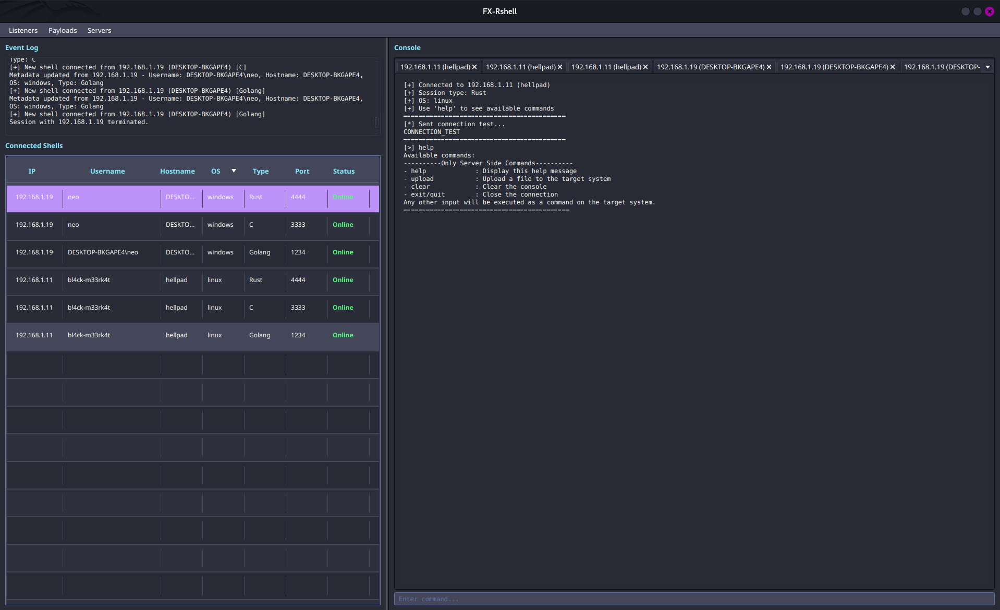

# FX-Rshell

```
8888888888 Y88b   d88P       8888888b.   .d8888b.  888               888 888 
888         Y88b d88P        888   Y88b d88P  Y88b 888               888 888 
888          Y88o88P         888    888 Y88b.      888               888 888 
8888888       Y888P          888   d88P  "Y888b.   88888b.   .d88b.  888 888 
888           d888b          8888888P"      "Y88b. 888 "88b d8P  Y8b 888 888 
888          d88888b  888888 888 T88b         "888 888  888 88888888 888 888 
888         d88P Y88b        888  T88b  Y88b  d88P 888  888 Y8b.     888 888 
888        d88P   Y88b       888   T88b  "Y8888P"  888  888  "Y8888  888 888 
                    FX-Rshell - JavaFX Reverse Shell Manager
```


---

## FX-Rshell

**FX-Rshell** is a JavaFX-based reverse shell interface for managing multiple remote shells in a centralized, tabbed UI.  
The goal is to use only very basic reverse shell clients, and implement all custom command-line logic on the server side.

> ⚠️ No OPSEC here — it's dirty, noisy, and triggers all kinds of events on the target machine.




---

## Features

### 🎧 Listener Management

- Create TCP listeners on custom ports  
- View and manage active listeners  
- Automatically handle incoming connections

### 👚 Shell Management

- Track multiple shells in a central table  
- View connection details (IP, username, hostname, OS)  
- Interact with each shell in its own tab  
- Right-click to kill a shell

### 💣 Payload Generator

- Generate reverse shell payloads in Go, C, or Rust  
- Configure for Windows or Linux targets  
- Select 32/64-bit architectures  
- Compile directly where you need it

### 🖥️ Shell Console

- Tabbed interface per shell session  
- Command history per shell  
- Navigate history with arrow keys  
- Visual separation between input and output

### 🌐 Server Manager

- Create an HTTP Python server to upload files to the target  
- Create an HTTP Python server to download files from the target

### ⚙️ Custom Server-Side Command Line

- `upload`  
- `download`

---

## Limitations
FX-Rshell is not a real C2, so it can only run one listener per port.
However, a single listener can handle multiple reverse shells from different systems.

### Example:
Listener on port 4444 → Windows client
Listener on port 4444 → Linux client

---

---

## 🛠️ Setup & Running

### Prerequisites

- Java 11+  
- JavaFX  

### Compiler Dependencies

#### Go Payloads

- Go 1.13+

```bash
# Ubuntu/Debian
sudo apt install golang-go

# Fedora
sudo dnf install golang

# Arch
sudo pacman -S go
```

- [Windows installer](https://golang.org/dl/)

#### C Payloads

- GCC

```bash
# Ubuntu/Debian
sudo apt install gcc gcc-multilib

# Fedora
sudo dnf install gcc glibc-devel.i686 libgcc.i686

# Arch
sudo pacman -S gcc lib32-gcc-libs
```

- Windows: [MinGW](http://mingw-w64.org/doku.php/download)

```bash
# Cross-compilation for Windows from Linux:
# Ubuntu/Debian
sudo apt install mingw-w64

# Fedora
sudo dnf install mingw64-gcc mingw32-gcc

# Arch
sudo pacman -S mingw-w64-gcc
```

#### Rust Payloads

- Rust toolchain (`cargo`, `rustc`)

```bash
curl --proto '=https' --tlsv1.2 -sSf https://sh.rustup.rs | sh
```

- [Windows installer](https://www.rust-lang.org/tools/install)

```bash
# Add cross targets
rustup target add i686-unknown-linux-gnu
rustup target add x86_64-pc-windows-gnu
rustup target add i686-pc-windows-gnu

# For Linux 32-bit builds
sudo apt install gcc-multilib
```

---

## 🧱 Building from Source

```bash
javac -d bin src/*.java
java -cp bin Main
```

---

## 🪪 Usage

1. Launch the app  
2. Create a listener (`Listeners > Create Listener`)  
3. Generate a payload (`Payloads > Choose Language`)  
4. Run the payload on a target machine  
5. When connected, the shell appears in the left panel  
6. Right-click > Interact or double-click to open a console  
7. Type commands 🚀  

---

## 💬 Shell Commands

Supports:

- Windows: `cmd.exe`  
- Linux: `bash` / `sh`

---

## 📁 Notes

- Payloads saved in `output/`  
- Compilation feedback shown in UI  
- No encryption (yet)  
- Metadata shown per shell  

---

## 🤡 Special Thanks

- That one tweet that inspired simplification  
- Me, for starting this in 30 min  
- ChatGPT, for 1h of fuel  
- Cursor, for doing most of the work  
- Copilot, for reminding me Cursor > Copilot

